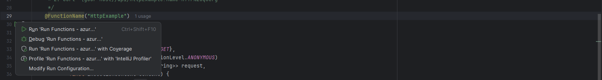
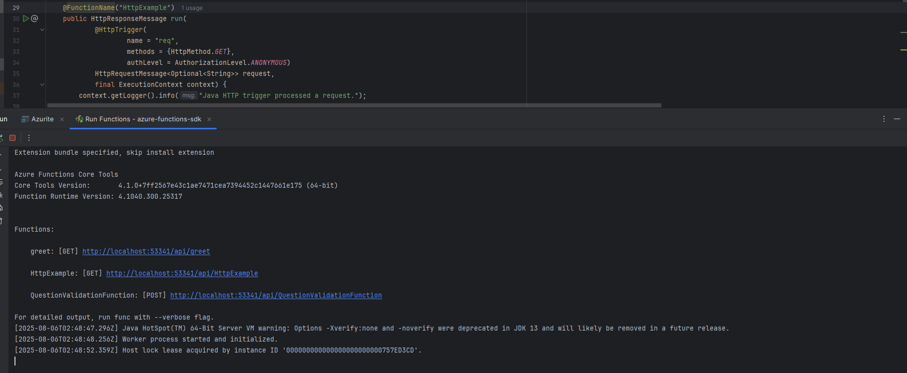
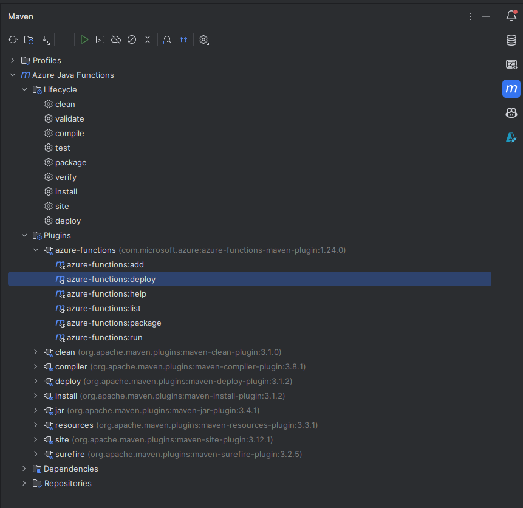

# Create And Config Azure With Java
- [**Create Project**](#create-project)
- [**Deploy Information**](#deploy-information)


## Create Project
- IDE Intellij
- use maven to create Project

### **1. Create Dashboard:**
- Catalog : `Maven Central`
- Archetype: `com.microsoft.azure:azure-functions-archetype`
- Version: `1.52`
- 

### **2. After Create:**
- 

### **3.1. Download Azure Cli to manage Microsoft account easily**
- Or Can Download when IntelliJ recommend
- `Download` -> `bin` (copy path in folder) -> Into `Environment variables` -> `path` -> `new` -> `paste bin path` 
- https://learn.microsoft.com/en-us/cli/azure/install-azure-cli-windows?view=azure-cli-latest&pivots=zip

### **3.2. Setup Azurite to storage account on local**
- https://learn.microsoft.com/en-us/azure/storage/common/storage-use-azurite?tabs=npm%2Cblob-storage
- `azurite --silent --location c:\azurite --debug c:\azurite\debug.log` (start)
- 

### **3.3 Download Microsoft Storage Explorer**
- https://azure.microsoft.com/en-us/products/storage/storage-explorer/?msockid=08d09ba9b404614b2dea8ac3b5626089
- when you run `Azurite` Storage Account will automatic to listen and you can see Table, you can create if it don't exist to test
- 

### **(Optional) Setup Azure Toolkit for IntelliJ**
- IntelliJ -> plugin -> search Azure Toolkit.
- After Add 
- Can connect and check storage account: 

### 4. **After set run function:**
- 
- 

### **5. Maven package:**
- 


### **6. Final Deploy:**
- Setup Information CLI: https://learn.microsoft.com/en-us/cli/azure/install-azure-cli-windows?view=azure-cli-latest&pivots=zip (to login Azure)
- 


---------------------
<br/>

## Deploy Information:
- In maven

```xml
 <plugins>
            <plugin>
                <groupId>org.apache.maven.plugins</groupId>
                <artifactId>maven-compiler-plugin</artifactId>
                <version>3.8.1</version>
                <configuration>
                    <source>${java.version}</source>
                    <target>${java.version}</target>
                    <encoding>${project.build.sourceEncoding}</encoding>
                </configuration>
            </plugin>
            <plugin>
                <groupId>com.microsoft.azure</groupId>
                <artifactId>azure-functions-maven-plugin</artifactId>
                <version>${azure.functions.maven.plugin.version}</version>
                <configuration>
                    <!-- function app name -->
                    <appName>${functionAppName}</appName>
                    <!-- function app resource group -->
                    <resourceGroup>java-functions-group</resourceGroup>
                    <!-- function app service plan name -->
                    <appServicePlanName>java-functions-app-service-plan</appServicePlanName>
                    <!-- function app region-->
                    <pricingTier>consumption</pricingTier>
                    <!-- refers https://github.com/microsoft/azure-maven-plugins/wiki/Azure-Functions:-Configuration-Details#supported-regions for all valid values -->
                    <region>westeurope</region>
                    <!-- function pricingTier, default to be consumption if not specified -->
                    <!-- refers https://github.com/microsoft/azure-maven-plugins/wiki/Azure-Functions:-Configuration-Details#supported-pricing-tiers for all valid values -->
                    <!-- <pricingTier></pricingTier> -->
                    <!-- Whether to disable application insights, default is false -->
                    <!-- refers https://github.com/microsoft/azure-maven-plugins/wiki/Azure-Functions:-Configuration-Details for all valid configurations for application insights-->
                    <!-- <disableAppInsights></disableAppInsights> -->
                    <runtime>
                        <!-- runtime os, could be windows, linux or docker-->
                        <os>windows</os>
                        <javaVersion>${java.version}</javaVersion>
                    </runtime>
                    <appSettings>
                        <property>
                            <name>FUNCTIONS_EXTENSION_VERSION</name>
                            <value>~4</value>
                        </property>
                    </appSettings>
                </configuration>
                <executions>
                    <execution>
                        <id>package-functions</id>
                        <goals>
                            <goal>package</goal>
                        </goals>
                    </execution>
                </executions>
            </plugin>
            <!--Remove obj folder generated by .NET SDK in maven clean-->
```

| Tag                                  | Complain                                                                                                 |
|--------------------------------------|----------------------------------------------------------------------------------------------------------|
| `<groupId>...</groupId>`             | The group Id specifies the group identifier for the plugin.                                              |
| `<artifactId>...</artifactId>`       | `artifactId` is the name of the project/module or library you are using or creating.                     |
| `<version>...</version>`             | Version specifies the version of the plugin to use                                                       |
| `<configuration>...</configuration>` | Where we provide specific configuration setting for the plugin.                                          |
| `<appName>...</appName>`             | Here you specifies the name of your Azure Functions Application.                                         |
| `<resourceGroup>...</resourceGroup>` | This defines the Azure resource group where your functions will be deployed in our case Azure Functions. |
| `<pricingTier>...</pricingTier>`     | You can specify the pricing tier for your functions.                                                     |
| `<region>...</region>`               | This determine the Azure region where your functions will be deployed.                                   |
| `<runtime>...</runtime>`             | Here you configure the runtime settings for your Azure Functions.                                        |
| `<os>..</os>`                        | OS Specifies the `Operation System` which set is to Window                                               |
| `<javaVersion>...</javaVersion>`     | This set java version for System                                                                         |
| `<appSettings>...</appSettings>`     | You can define Application settings specific to your functions.                                          |
| `<executions>...</executions>`       | We define when and how the Plugin's goal should be executed                                              |
|                                      |                                                                                                          |
